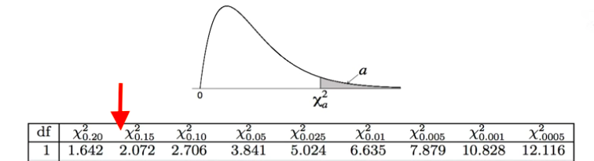

---
- [Introduction](#introduction)
- [Data](#data)
- [Hypotheses](#hypotheses)
- [Planning pipeline](#planning-pipeline)
- [Results](#results)
- [Recommendations](#recommendations)

## Introduction

Customer's leaving, or churning, is a common problem in the telecommunications industry. It is a critical metric because it is much less expensive to retain existing customers than it is to acquire new ones. To reduce customer churn, telecom companies need to predict which customers are at high risk of churn.

## Data

The data contains information about 7,043 customers, specifically:

**Customers who left within the last month** – the column is called churn. 1,869 customers did it

**Services that each customer has signed up for** – phone, multiple lines, internet, online security, online backup, device protection, tech support, and streaming TV and movies

**Customer account information** - how long they’ve been a customer, contract, payment method, paperless billing, monthly charges, and total charges

**Demographic info about customers** – gender, age range, and if they have partners and dependents

Customers are price sensitive. No surprise there but it turns out high monthly bills are driven by fiber optic plans.  The average customer pays 65 USD per month and has been with the company for 32 months. The median customers pays more (70 USD) but hasn't been a customer as long (29 months.)

Month-to-month customers churn at a mich higher rate than customers on yearly plans. Across all models, this was the best feature for predicting customer retention.

Fiber optic usage was the second best feature and it turns out to be highly correlated with monthly charges because it's dang expensive.

Customers using e-checks leave at a higher rate than the others. This was a good feature for logistic regression

A look at correlations between features. Notice the white squares indicating the highest correlations, which is addressed in preprocessing.

## Hypotheses

#### Chi-Squared contingency tables

##### H0 Gender is independent of churn.

##### H1 Churn depends on gender.

I ran a chi-squared test for every variable but here I've only included the two in which the null hypothesis was not rejected, meaning all other variable distributions indicated a relationship with churn.

* Bonferroni correction = 4
* chi^2 = 0.484
* p     = 0.9999

**Conclusion: Do not reject the null.** Gender is independent of churn.

##### H0 Phone service is independent of churn.

##### H1 Churn depends on phone service.

* Bonferroni correction = 4
* chi^2 = 0.915
* p     = 0.9999

**Conclusion: Do not reject the null.** Phone service is independent of churn.

#### Pearson's correlation

##### H0 There is no linear correlation between monthly charges and months tenure.

##### H1 There is a linear correlation between monthly charges and months tenure.

Here is the rather dubious correlation. This result can easily be mininterpreted due to **survivoship bias**. It's not accurate to say customer's are willing to pay more over time because customers who are not don't stick around.

* Pearson correlation = 0.248
* p-value             = 0.000

**Conclusion: Reject the null.** There is a linear correlation between monthly charges and months tenure.

#### McNemar's test

McNemar’s test operates upon a contingency table similar to chi-squared. In fact, the test statistic has a Chi-Squared distribution with 1 degree of freedom. McNemar’s test is a paired nonparametric or distribution-free statistical hypothesis test. The test is checking if the disagreements between two cases match. Here is how the statistic is calculated.

test statistic = (Yes/No - No/Yes)^2 / (Yes/No + No/Yes)

where Yes/No is the count of test instances that Classifier 1 got correct and Classifier 2 got incorrect, and No/Yes is the count of test instances that Classifier 1 got incorrect and Classifier 2 got correct, assuming a minimum of 25 of each.

##### H0 *Logistic regression* and *random forest* disagree to the same amount.

##### H1 There is evidence that the cases disagree in different ways, that the disagreements are skewed.

* McNemar's t-stat = 3.2
* p-value          = 0.07

**Conclusion: Reject the null** (at alpha=0.10.) The models are making different predictions.

##### H0 *Logistic regression* and *decision tree* disagree to the same amount.

##### H1  There is evidence that the cases disagree in different ways, that the disagreements are skewed.

* McNemar's t-stat = 0.12
* p-value          = 0.73

**Conclusion: Do not reject the null** at alpha egual to 0.10. The models disagree to the same amount.

## Planning pipeline

Step 1: Plan

*Business objective:* reduce churn by 5 percent.

*Project objective:* maximize F1 score for the positive (churn) class.

Why F1 and not accuracy? Because predicting the positive class correctly has more business value than predicting the negative class correctly. Consider this table of costs:

| actual/predicted | churn | stay |
| - | - | - |
| churns | no cost | customer stays w/ additional action |
| stays | lose customer w/o action | no cost |

In this case, the **false negative** has significantly greater cost compared to a **false positive** and th metric choice should reflect that,

Step 2: Acquire

If data is in a SQL database, run select * from telco_churn.customers via SQL IDE.
If data is a csv file, use pandas, e.g. pandas.read_csv().
These steps are covered in acquire.py.

Step 3: Prepare Data

There are no missing values.
Convert all features to floats or categorical variables using one-hot encoding.
Split data into 70/15/15 training/validation/test sets.
These steps are covered in prepare.py.

Drop highly mulitcollinear features - *monthly charges* and *total charges* - and features independent of churn - *gender* and *phone service*. Here are the variable inflation factors without dropping the aforementioned variables.
 

Step 4: Explore & Preprocess

Visualize attributes & interactions (Python: seaborn and matplotlib).
Analyze: statistically and more generally (Python: statsmodels, numpy, scipy, scikit-learn).

A note on feature engineering: Two attempts at feature engineering resulted in multicollinear variables with no improvement in models' predictions. One was bins for monthly charges and the second was a binary variable indicating contract expiration month.

Step 5: Model

Train on minority oversampled data using SMOTE.

Models used:

* Logistic Regression (reduced feature selection: tenure, month-to-month, e-check, fiber optic)
* Random Forest (hyperparameters: ccp_alpha = .003)
* Decision tree (hyperparameters: ccp_alpha = .007)
* kNN (hyperparameters: n_neighbors = 18)

As an additional step, I used McNemar's test to compare models and found logistic regression and the decision tree produced predictions without a meaningful difference. The model used to output predictions was the decision tree

## Results

#### Did we do better than the baseline?

The baseline predicts every customer leaves every month; not terrribly intelligent. (Were I maximizing for accuracy, I'd predict every customer stays but, as discussed above, the business value lies in predicting churn (positive class) and not predicting retention (negative class).)

*"A theory that explains everything, explains nothing." -Karl Popper*

* Before: Out of 100 customers, identifies all as a having a 1/4 chance of churning.

* After: Out of 100 customers, picks out 40 and this subset includes 20 of 25 churning customers.

The model's predictions can be thought of as a concentrated solution putting (most) high-risk customers in a smaller subset.

| model | precision | recall | F1 | accuracy
| --- | --- | --- | --- | --- |
| baseline | .26 | 1 | .42 | .26 |
| tree | .52 | .79 | .63 | .75 |

A note on model selection: Logistic regression produced similar results. In fact, McNemar's test showed no difference in the distribution of predictions. The choice of a decision tree came down to interpretability and it's overwhelmingly simple classification process, which asks only three questions:

## Recommendations

* Make a real-time prediction page using Flask.
* Have a team of salespeople call high-risk customers and perhaps offer a discount on internet.
* Acquire more data for a better model. Deep learning on a much larger dataset could produce a very high accuracy.
* Conduct satisfaction surveys. Are there qualitative factors at play not captured here?

