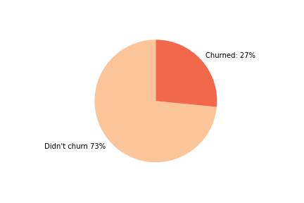
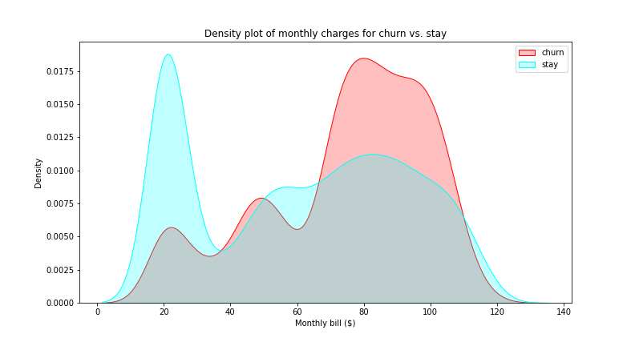
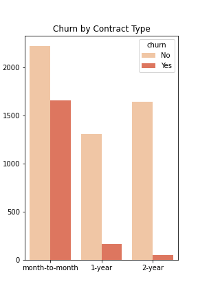
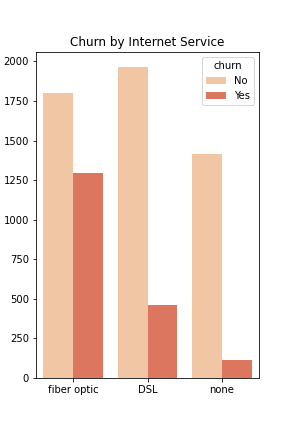
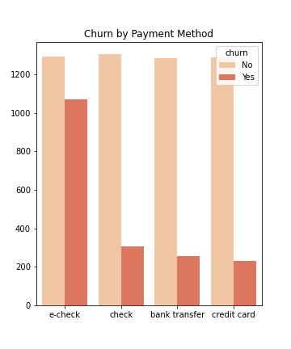
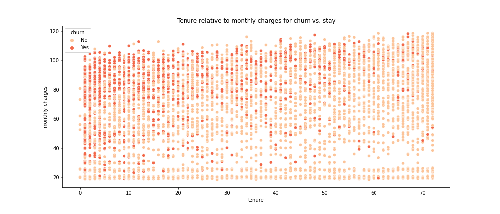
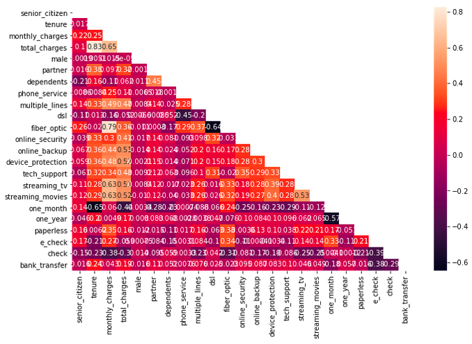
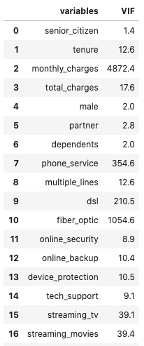
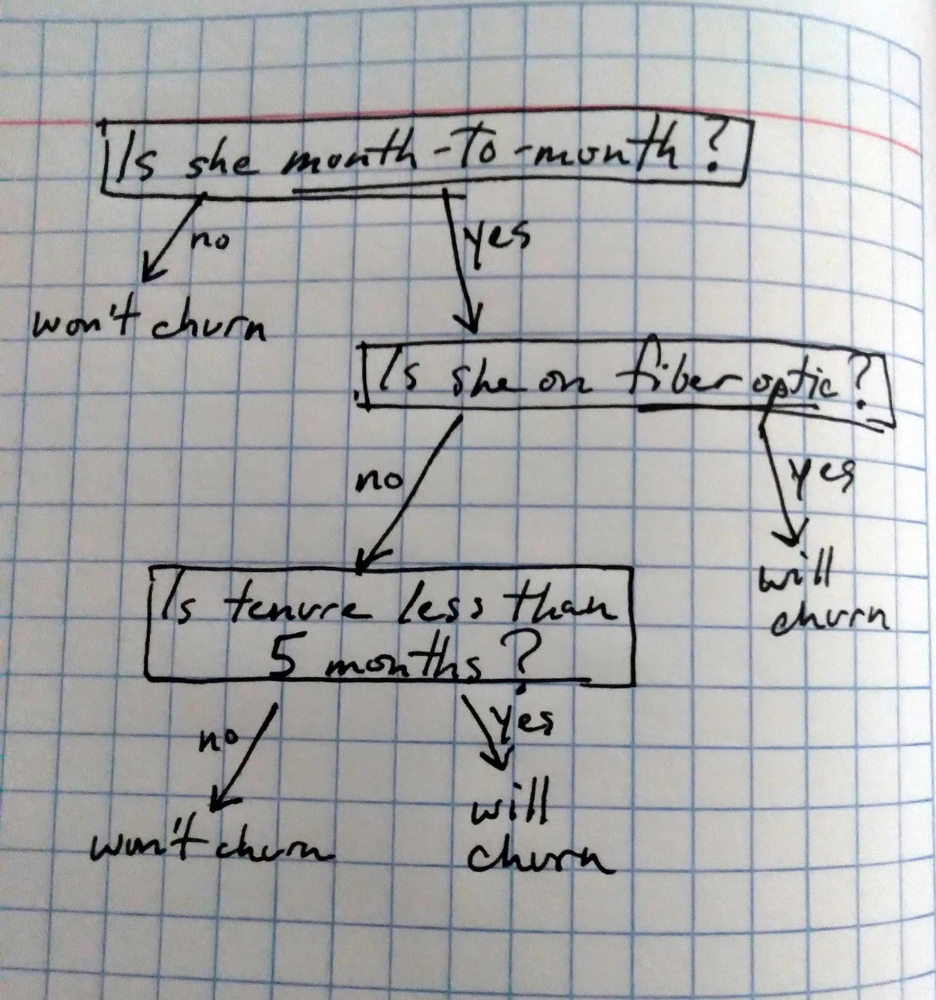

---
- [Introduction](#introduction)
- [Data](#datadict)
- [Hypotheses](#hypotheses)
- [Planning pipeline](#pipeline)
- [Method](#method)
- [Results](#results)
- [Recommendations](#recommendations)

## Introduction

Customer's leaving, or churning, is a common problem in the telecommunications industry. It is a critical metric because it is much less expensive to retain existing customers than it is to acquire new ones. To reduce customer churn, telecom companies need to predict which customers are at high risk of churn.

## Data

The data contains information about 7,043 customers, specifically:

**Customers who left within the last month** – the column is called churn. 1,869 customers did it

**Services that each customer has signed up for** – phone, multiple lines, internet, online security, online backup, device protection, tech support, and streaming TV and movies

**Customer account information** - how long they’ve been a customer, contract, payment method, paperless billing, monthly charges, and total charges

**Demographic info about customers** – gender, age range, and if they have partners and dependents

Customers are price sensitive. No surprise there but it turns out high monthly bills are driven by fiber optic plans.  The average customer pays 65 USD per month and has been with the company for 32 months. The median customers pays more (70 USD) but hasn't been a customer as long (29 months.)

Month-to-month customers churn at a mich higher rate than customers on yearly plans. Across all models, this was the best feature for predicting customer retention.

Fiber optic usage was the second best feature and it turns out to be highly correlated with monthly charges because it's dang expensive.

Customers using e-checks leave at a higher rate than the others. This was a good feature for logistic regression

## Hypotheses

#### Chi-Squared contingency tables

$H_0$ Gender is independent of churn.

$H_1$ Churn depends on gender.

Bonferroni correction = 4
chi^2 = 0.484
p     = 0.9999

**Conclusion: Do not reject the null.** Gender is independent of churn.

$H_0$ Phone service is independent of churn.

$H_1$ Churn depends on phone service.

Bonferroni correction = 4
chi^2 = 0.915
p     = 0.9999

**Conclusion: Do not reject the null.** Phone service is independent of churn.

#### Pearson's correlation

$H_0$ There is no linear correlation between monthly charges and months tenure.

$H_1$ There is a linear correlation between monthly charges and months tenure.

Pearson correlation = 0.248
p-value             = 0.000

**Conclusion: Reject the null.** There is a linear correlation between monthly charges and months tenure.

#### McNemar's test

$H_0$ *Logistic regression* and *random forest* disagree to the same amount.

$H_1$ There is evidence that the cases disagree in different ways, that the disagreements are skewed.

McNemar's t-stat = 3.2
p-value          = 0.07

**Conclusion: Reject the null** (at alpha=0.10.) The models are making different predictions.

$H_0$ *Logistic regression* and *decision tree* disagree to the same amount.

$H_1$ There is evidence that the cases disagree in different ways, that the disagreements are skewed.

McNemar's t-stat = 0.12
p-value          = 0.73

**Conclusion: Do not reject the null** (at alpha=0.10.) The models disagree to the same amount.

McNemar’s test operates upon a contingency table similar to Chi-Squared. In fact, the test statistic has a Chi-Squared distribution with 1 degree of freedom. McNemar’s test is a paired nonparametric or distribution-free statistical hypothesis test. The test is checking if the disagreements between two cases match. Here is how the statistic is calculated.

test statistic = (Yes/No - No/Yes)^2 / (Yes/No + No/Yes)

where Yes/No is the count of test instances that Classifier 1 got correct and Classifier 2 got incorrect, and No/Yes is the count of test instances that Classifier 1 got incorrect and Classifier 2 got correct, assuming a minimum of 25 of each.

## Planning pipeline

## Method

1. Load Telco data (acquire.py).

2. Convert all features to numeric (prepare.py).

3. Drop highly mulitcollinear features - *monthly charges* and *total charges* - and features independent of churn - *gender* and *phone service*.

4. Train/validation/test split is 70/15/15.

5. Oversample minority class in training data with SMOTE.

6. Fit sklearn's *decision tree classifier* with ccp_alpha=.007.

## Results

#### Did we do better than the baseline?

The baseline predicts every customer leaves every month, not terrribly intelligent.

*"A theory that explains everything, explains nothing." -Karl Popper*

* Before: Out of 100 customers, identifies all as a having a 1/4 chance of churning.

* After: Out of 100 customers, picks out 40 and this subset includes 20 of 25 churning customers.

The model's predictions can be thought of as a concentrated solution putting more high-risk customers in a smaller subset.

| model | precision | recall | F1 | accuracy
| --- | --- | --- | --- | --- |
| baseline | .26 | 1 | .42 | .26 |
| tree | .52 | .79 | .63 | .75 |

 A note on model selection: Logistic regression produced similar results. In fact, McNemar's test showed no difference in the distribution of predictions. The choice of a decision tree came down to interpretability and it's overwhelmingly simple classification process, which asks only three questions:

## Recommendations

* Make a real-time prediction page using Flask.
* Have a team of salespeople call high-risk customers and perhaps offer a discount on internet.
* Acquire more data for a better model. Deep learning on a much larger dataset could produce a very high accuracy.
* Conduct satisfaction surveys. Are there qualitative factors at play not captured here?

